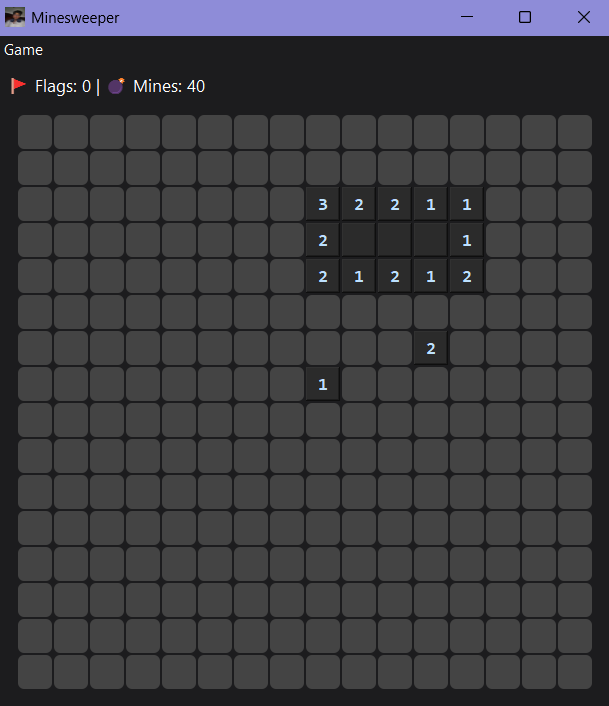
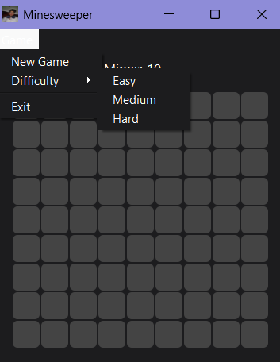

# 💣 PyQt5 Minesweeper Game

A modern Minesweeper clone built with **Python** and **PyQt5**, featuring difficulty levels, right-click flagging, and a restart prompt on game over.

---

## 📦 Requirements

- Python 3.6+
- PyQt5

---

## ⚙️ Installation Guide

### 1. Install Python

Download and install Python from the official site:  
👉 https://www.python.org/downloads/

Ensure Python is added to your system PATH.

### 2. Install PyQt5

Open a terminal or command prompt and run:

```bash
pip install pyqt5
```

> Optional (for better packaging):  
```bash
pip install pyqt5-tools
```

---

## ▶️ How to Run

1. Clone or download this repository.
2. Navigate to the project folder.
3. Run the Python file:

```bash
python minesweeper.py
```

> Replace `minesweeper.py` with your actual filename.

---

## 🎮 Features

- ✅ Easy (9x9), Medium (16x16), Hard (24x24) difficulty modes
- ✅ Right-click to flag suspected mines (🚩)
- ✅ Reveals cells and their adjacent mine count
- ✅ Game over popup with **restart** option
- ✅ Modern dark UI with emoji icons
- ✅ Flag and mine counter

---

## 📁 File Structure

```
.
├── minesweeper.py       # Main game file
├── README.md            # This file
└── assets/              # (Optional) Add icons/images here
```

---

## 🧠 Screenshot (Optional)






---

## 📌 Notes

- Tested on **Windows 11** with **Python 3.11**
- Feel free to customize colors, icons, or difficulty levels

---

## 📜 License

Do whatever you want — just don't click the mine 😆

---
## Contact

- 📧 gmail : agrimjusta@gmail.com
- 🔗 LinkedIn : https://in.linkedin.com/in/agrim-justa


